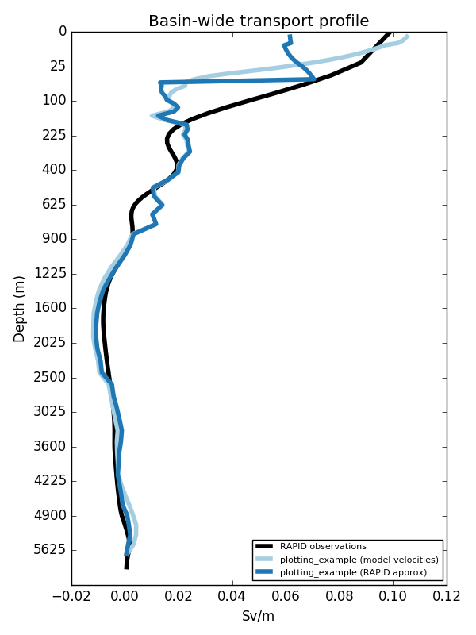
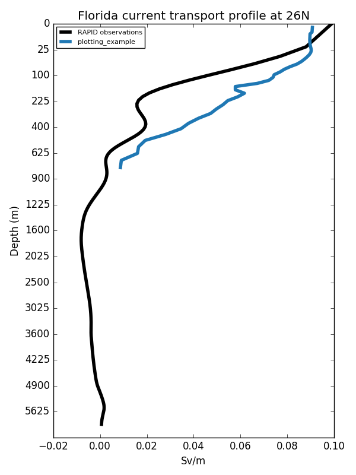
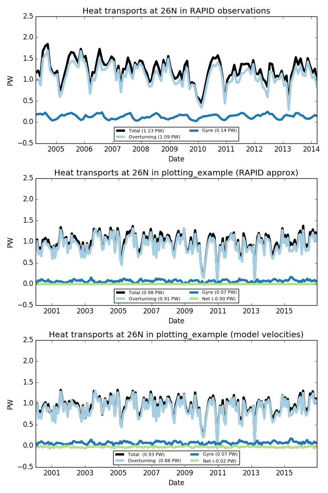
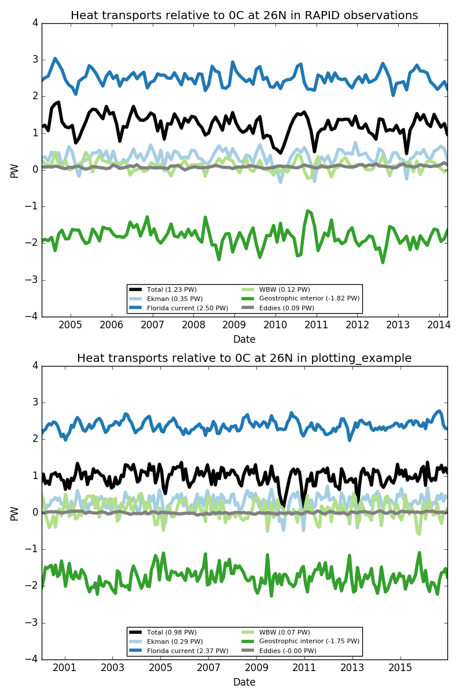
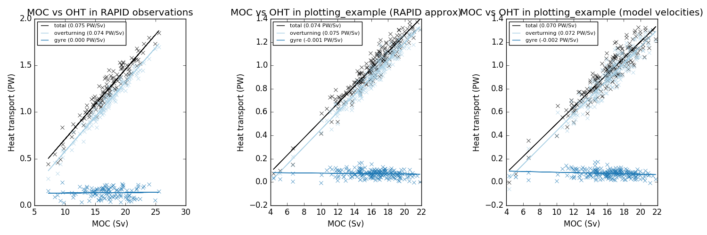
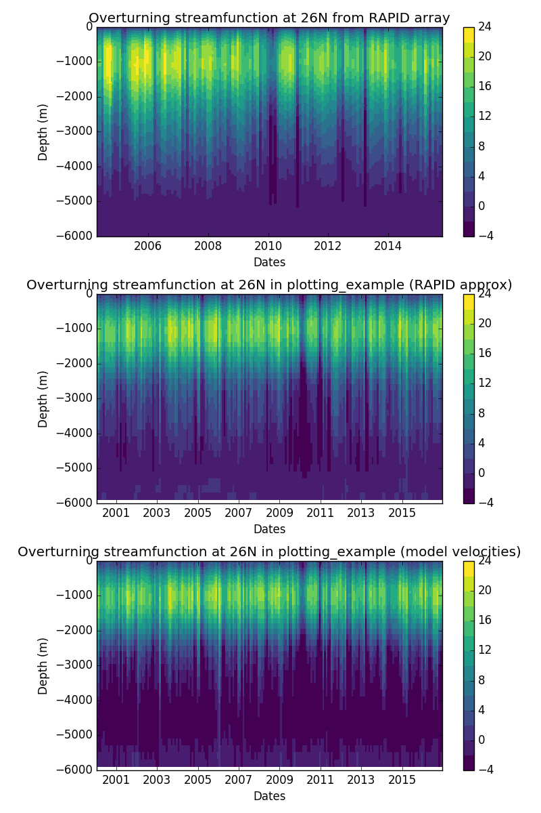
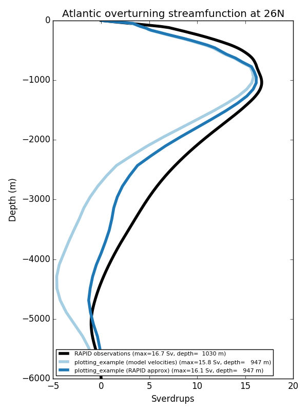
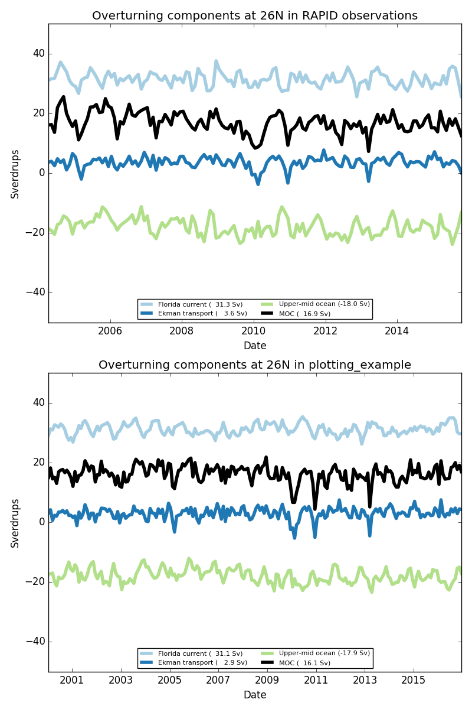
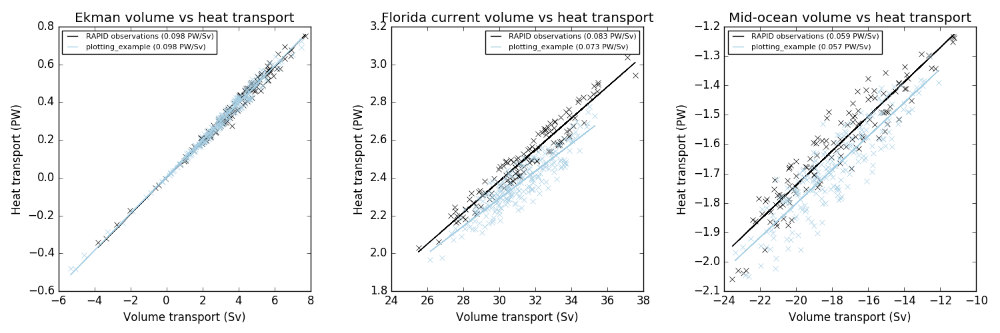
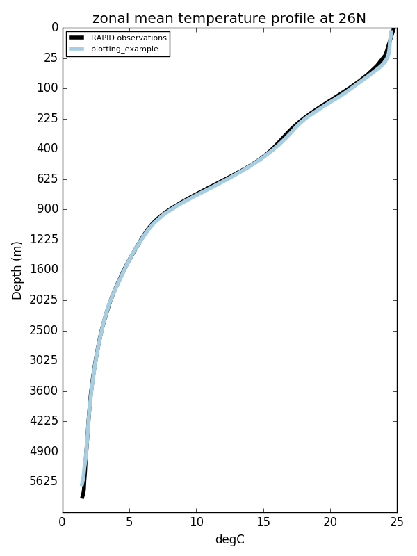

# RapidMoc
This package calculates diagnostics of the Atlantic meridional overturning circulation (AMOC) using output from an ocean general circulation model and plots comparison with observed data from the RAPID-MOCHA array at 26N. Observational data and further details about the RAPID-MOCHA array can be found [here](http://www.rapid.ac.uk/) and [here](https://www.rsmas.miami.edu/users/mocha/mocha_results.htm).

## Methods and motivation

Since April 2004, the RAPID-MOCHA array at 26N has made continuous observations of the strength and vertical structure of volume and heat transports in the North Atlantic ([Cunningham et al., 2007](http://science.sciencemag.org/content/317/5840/935); [Johns et al., 2011](http://journals.ametsoc.org/doi/abs/10.1175/2010JCLI3997.1)).  To do this, the array combines sub-marine cable measurements of the Florida current, Ekman transports calculated from zonal wind stress, western boundary wedge (WBW) transports measured using current meters, geostrophic transports measured with dynamic height moorings in the ocean interior, and a mass compensation term to ensure that there is zero net transport through the section ([McCarthy et al., 2015](http://www.sciencedirect.com/science/article/pii/S0079661114001694)).

In order to provide the most appropriate comparisons, RapidMoc calculates model transports using an analagous 'RAPID-style' methodology which can be summarized as follows:

* Full-field model velocities are used in the Florida Current and western boundary wedge.
* Meridional Ekman transports are calculated from zonal wind stress.
* Interior geostrophic transports are calculated relative to a specified level of no motion.
* A mass-compensation term is applied as a uniform adjustment to the interior geostrophic velocity field to ensure zero net-flow across the section.

The model-based methodology employed by RapidMoc and the impact of uncertainties in the geostrophic level of no motion is described further by [Roberts et al. (2013)](http://onlinelibrary.wiley.com/doi/10.1002/grl.50930/full).

## Using RapidMoc
#### Required python libraries
RapidMoc was developed using Python 2.7 and requires the installation of the following python libraries and their associated dependencies: `numpy`, `netCDF4`, `ConfigParser`, `argparse`, `os`, `matplotlib`, `abc`, `datetime`, `scipy`, `copy`, and `math`. 


#### Cloning the git repository
To retrieve a copy of the RapidMoc source code and create a working directory, run the following on the command line: 

```> git clone git@github.com:cdr30/RapidMoc.git```

or 

```> git clone https://github.com/cdr30/RapidMoc.git```


#### Running RapidMoc
RapidMoc is invoked from the command line using the `run_rapidmoc.py` script. Running with the `-h` option will return a help message on the required arguments.

```
> ./run_rapidmoc.py -h 
usage: run_rapidmoc.py [-h] config_file tfile sfile taufile vfile

Calculate RAPID AMOC diagnostics using ocean model data

positional arguments:
  config_file  Path to configuration file.
  tfile        Path for netcdf file(s) containing temperature data.
  sfile        Path for netcdf file(s) containing salinity data.
  taufile      Path for netcdf file(s) containing zonal wind stress data.
  vfile        Path for netcdf file(s) containing meridional velocity data.

optional arguments:
  -h, --help   show this help message and exit
```

Netcdf files can be specified using a specific path or a glob pattern as show in the example below:
```
run_rapidmoc.py  config.ini "/path/to/tfiles_????.nc" "/path/to/sfiles_????.nc" "/path/to/taufiles_????.nc" "/path/to/vfiles_????.nc" 
```

*Important*: glob patterns must be surrounded by quotation marks to prevent the shell from expanding them automatically on the command line. 


## Model data
The methods used by RapidMoc are robust across different ocean model grids, but all model data is assumed to be shaped as follows:

```
3D fields (i.e. T, S, V) = (nt,nz,ny,nx)
2D fields (i.e. tau) = (nt,ny,nx)

```
where the x-coordinate is assumed to be approximately zonal, and the y-coordinate is assumed to be approximately meridional. Some deviations from this assumption are accounted for when estimating cell bounds and for along-section interpolation of data onto the velocity grid. These operations are designed to work with generalized curvilinear coordinate grids (e.g. the NEMO ORCA grid) and different grid stencils. However, it is assumed throughout the code that sub-sections can be selected using longitude pairs. Extracted sections that do not have an x-coordinate of monotonically increasing longitude data will probably not behave as expected.

## Observational data
In order to use the plotting functionality of RapidMoc, the following observational data sets must be downloaded from the RAPID-MOCHA project web-pages:

* `mocha_mht_data_*.nc` - a netcdf file containing heat transport data available from the [MOCHA project web site](https://www.rsmas.miami.edu/users/mocha/mocha_results.htm)  

* `moc_vertical_*.nc` and `moc_transports_*.nc` - netcdf files containing volume transports and overturning stream functions available from the [RAPID project web site](http://www.rapid.ac.uk/rapidmoc/rapid_data/datadl.php).

## Plotting API
The plotting API can be accessed without having to re-run the RapidMoc calculation.  This interface is designed to be used when it necessary to run RapidMoc on multiple "chunks" of data before combining the output into a single netcdf file to create the plots.


```
from netCDF4 import Dataset

import rapidmoc.observations as rapidobs
import rapidmoc.plotdiag as rapidplot

oht = rapidobs.HeatTransportObs('mocha_mht_data.nc', time_avg='monthly')
vol = rapidobs.VolumeTransportObs('moc_transports.nc', time_avg='monthly')
sf = rapidobs.StreamFunctionObs('moc_vertical.nc', time_avg='monthly')
trans = Dataset('model_meridional_transports_at_26N.nc')

rapidplot.plot_diagnostics(trans, sf, vol, oht, outdir='./',name='plotting_example')

```

Example plots are included at the end of this document.

## Configuration files
In order to run RapidMoc, it is necessary to provide a `config.ini` that describes the ocean model data format and specifies options for the RapidMoc calculation. Several example `config.ini` files are provided within the  `etc/` directory. A description of the contents of the `config.ini` file is provided below.

```
[temperature/salinity/tau/meridional_velocity]
var = netcdf variable name for temperature/salinity/tau/meridional_velocity data in tfile/sfile/taufile/vfile [string]
xcoord = netcdf variable name for x coordinate in tfile/sfile/taufile/vfile [string]
ycoord = netcdf variable name for y coordinate in tfile/sfile/taufile/vfile [string]
zcoord = netcdf variable name for z coordinate in tfile/sfile/taufile/vfile [string, not required for taufile]
tcoord = netcdf variable name for time in tfile/sfile/taufile/vfile [string]
i1 = minimum index in x coordinate used to extract zonal section from tfile/sfile/taufile/vfile [integer]
i2 = maximum index in x coordinate used to extract zonal section from tfile/sfile/taufile/vfile [integer]
j1 = minimum index in y coordinate used to extract zonal section from tfile/sfile/taufile/vfile [integer]
j2 = maximum index in y coordinate used to extract zonal section from tfile/sfile/taufile/vfile [integer] 
maskf = path to netcdf file containing explicit data mask [string, optional]
maskvar = netcdf variable name for mask in maskf [string, optional]
maskmdi = missing data indicator for maskvar [float, optional]

[observations]
heat_transports = path to mocha mht data.nc [string]
volume_transports = path to moc transports.nc [string]
streamfunctions = path to moc vertical.nc [string]
time_avg = monthly or yearly [string, optional]

[options]
georef_level = depth used as geostrophic level of no motion [float]
ekman_depth = depth used as bottom of ekman layer [float]
fc_minlon = longitude corresponding to western boundary of florida current [float, -180 to 180]
fc_maxlon = longitude corresponding to boundary between florida current and wbw [float, -180 to 180]
wbw_maxlon = longitude corresponding to boundary between wbw and geostrophic interior [float, -180 to 180]
int_maxlon = longitude corresponding to eastern boundary of geostrophic interior [float, -180 to 180]

[output]
date_format = format string used with datetime.strftime, e.g. '%Y%m%d' [string]
name = descriptive string used to describe model experiment [string]
plot = boolean used to enable/disable plotting [boolean] 
outdir = path to output directory where data/plots are saved [string]
```

Note that it is possible to specify a range of indices in the y-direction. If `j1 != j2`, then data is extracted over a range of j-indices and then averaged to create a single zonal section. This allows data to be specified in a way that respects the staggering of the original model grid. 

## Example plots










